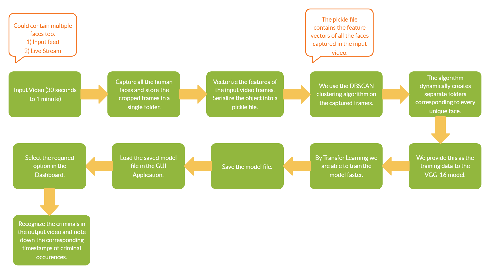
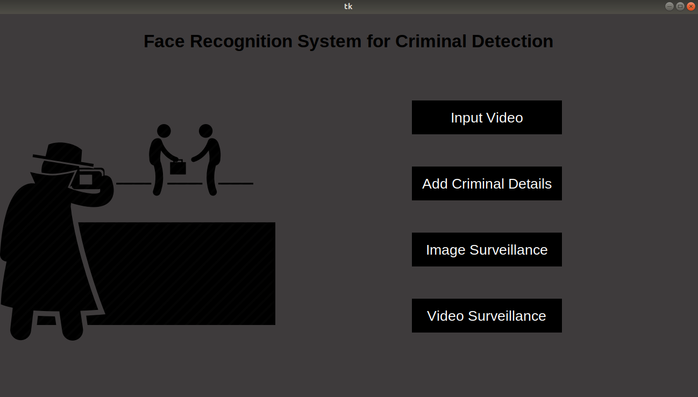
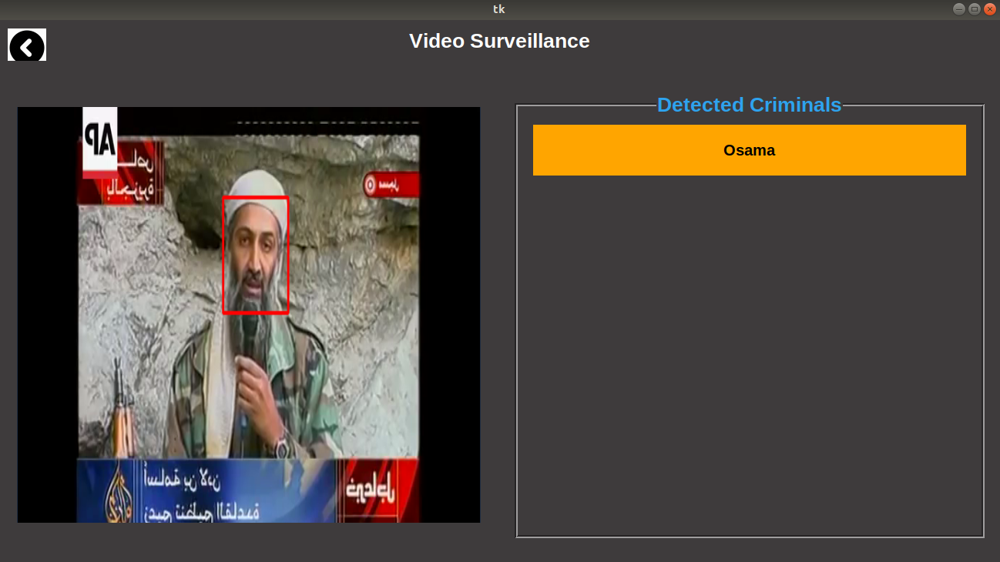

<h2>Project title : Facial Recognition for Crime Detection. </h2>

Workflow Pipeline : 

<h4>Problem Statement: Build a face recognition analytics system for law enforcement agencies </h4>

<h4>Problem Description: </h4>
The security of India is becoming ever more critical in this new world. There is an expectation of a slew of organized crime activities that may attempt to cripple our law enforcement and defense agencies. In such a scenario, technology becomes of paramount importance.

One aspect of the use of technology in law enforcement is video analytics, and video analytics has various components. One of the components is to identify patterns across different videos.

The task here is to analyze a 30 second- 1 min video, and capture faces of the people in the same, and then analyze another video to see how many of the persons in the first video are seen again in the second video and at what times.

Now, if the above technology is used for thousands of videos gathered from hundreds of intelligence sources, with cross-checks across all videos, really significant information on patterns in any form of organized crime can be identified.

<h4>Model Build on Keeping These Criteria in Mind: </h4>
Performance of model 
Model selection  
Scalability  
Scalability of model 
Retrainable model 
Accessibility  
User friendly  
Accuracy  

<h4>Steps To Run:<h4>
<h5>Step1: Run reqiurement.txt file to install libraries required. 
Step2: Run home.py file. 
  Step3: Start experiencing the Gui.</h5>

<h4> Snippets of Project</h4>

